# 📊 Flow Diagram — Sistem Arsip Bapekom

> Dokumen ini berisi visualisasi alur kerja (flow diagram) dari seluruh fitur aplikasi **Arsip Bapekom** menggunakan diagram Mermaid.

---

## Daftar Isi

1. [Arsitektur Sistem (Overview)](#1-arsitektur-sistem-overview)
2. [Flow Login & Autentikasi](#2-flow-login--autentikasi)
3. [Flow Middleware & Proteksi Route](#3-flow-middleware--proteksi-route)
4. [Flow Dashboard](#4-flow-dashboard)
5. [Flow CRUD Arsip](#5-flow-crud-arsip)
   - 5.1 [Tambah Arsip Baru](#51-tambah-arsip-baru)
   - 5.2 [Lihat Daftar Arsip](#52-lihat-daftar-arsip)
   - 5.3 [Detail & Edit Arsip](#53-detail--edit-arsip)
   - 5.4 [Hapus Arsip](#54-hapus-arsip)
6. [Flow Upload File ke Cloud](#6-flow-upload-file-ke-cloud)
7. [Flow Struktur Folder Cloud](#7-flow-struktur-folder-cloud)
8. [Flow Browse Arsip (Folder View)](#8-flow-browse-arsip-folder-view)
9. [Flow Filter & Pencarian](#9-flow-filter--pencarian)
10. [Flow Export Arsip](#10-flow-export-arsip)
11. [Flow Notifikasi](#11-flow-notifikasi)
12. [Flow Manajemen User](#12-flow-manajemen-user)
13. [Flow Profil Pengguna](#13-flow-profil-pengguna)
14. [Flow Koneksi Storage](#14-flow-koneksi-storage)
15. [Flow RBAC (Hak Akses)](#15-flow-rbac-hak-akses)
16. [Flow Rate Limiting](#16-flow-rate-limiting)
17. [Ringkasan Seluruh API](#17-ringkasan-seluruh-api)

---

## 1. Arsitektur Sistem (Overview)

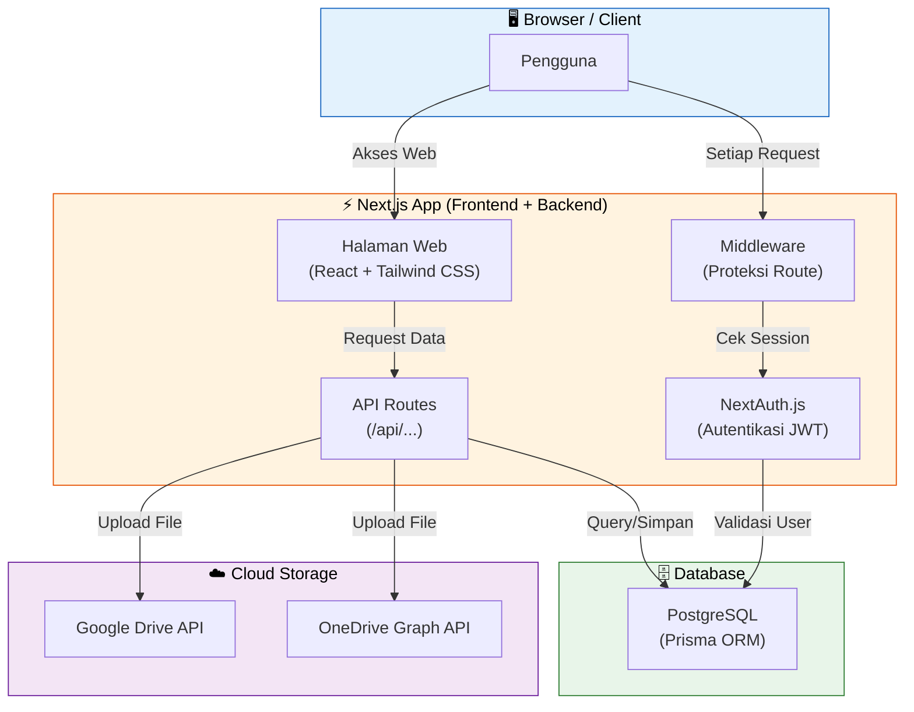

---

## 2. Flow Login & Autentikasi

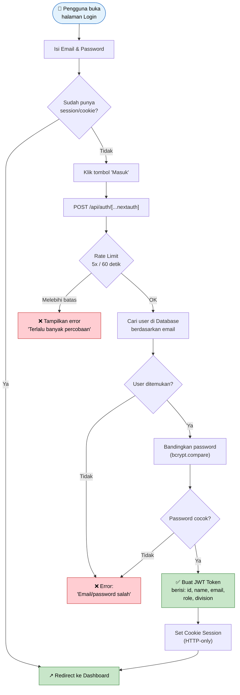

### Data di Dalam JWT Token

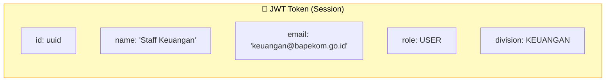

---

## 3. Flow Middleware & Proteksi Route

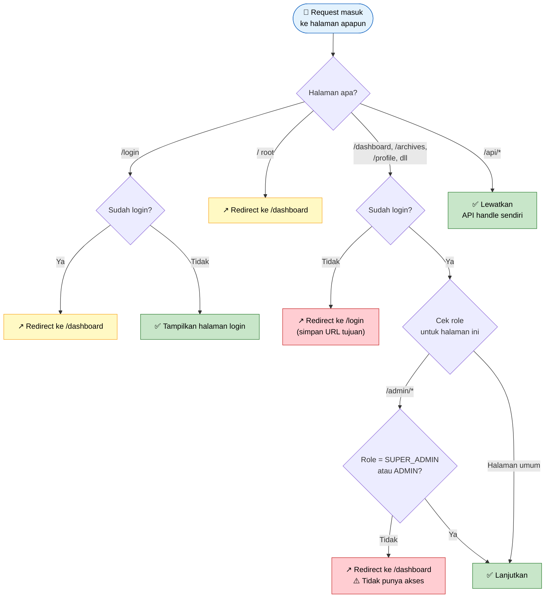

### Tabel Proteksi Route

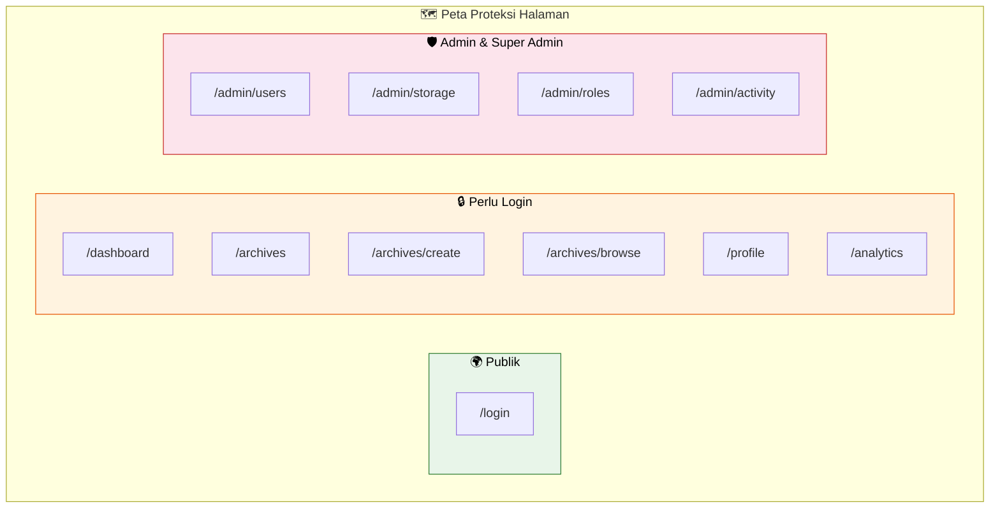

---

## 4. Flow Dashboard

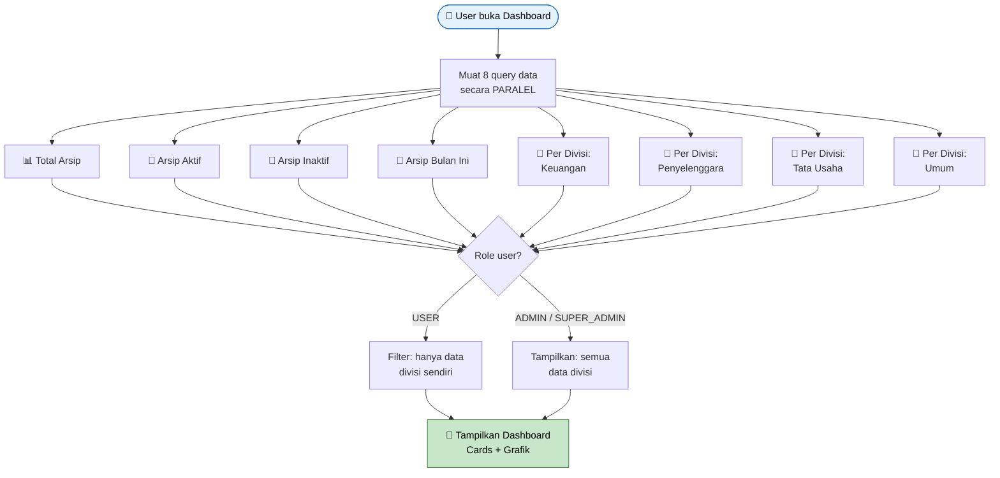

---

## 5. Flow CRUD Arsip

### 5.1 Tambah Arsip Baru

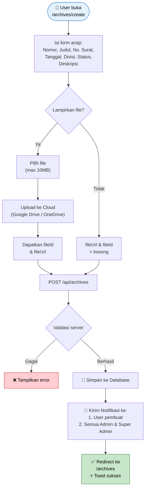

### 5.2 Lihat Daftar Arsip

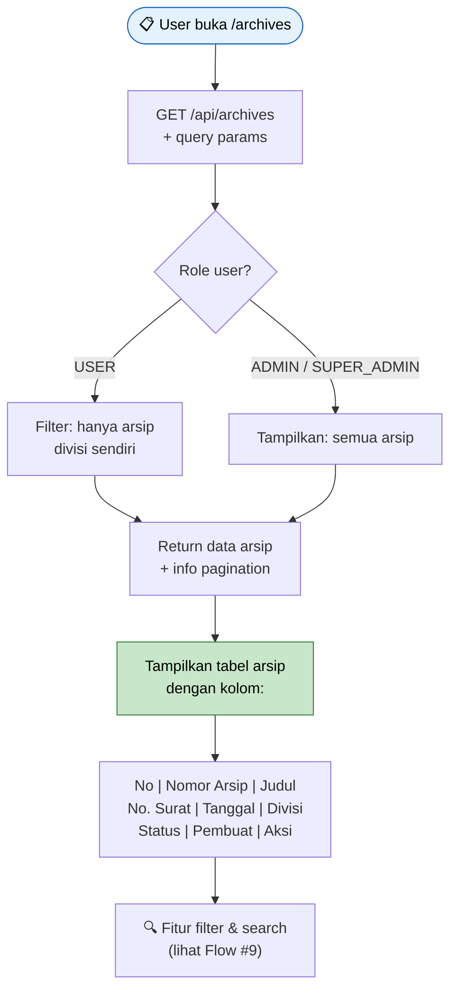

### 5.3 Detail & Edit Arsip

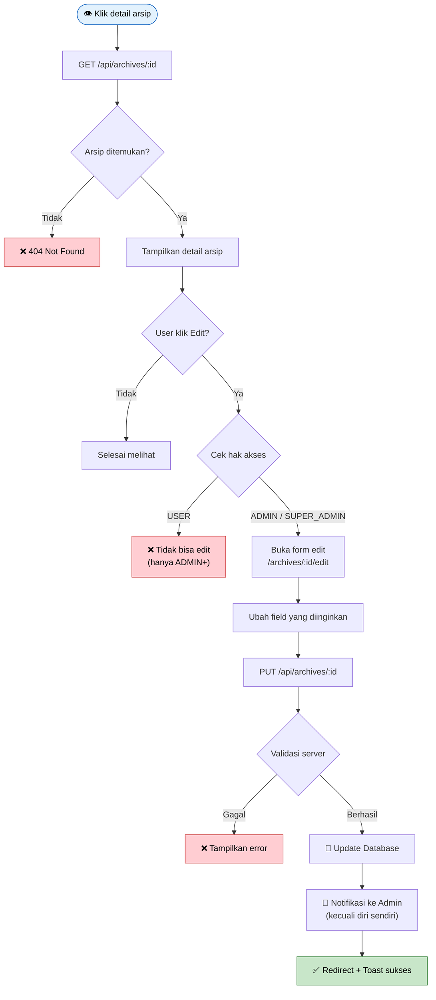

### 5.4 Hapus Arsip

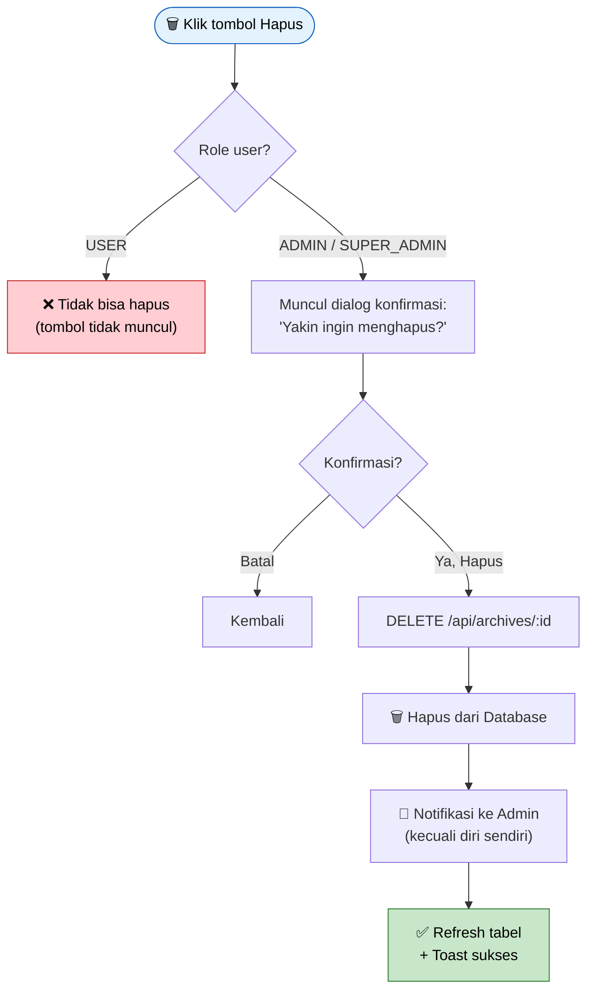

---

## 6. Flow Upload File ke Cloud

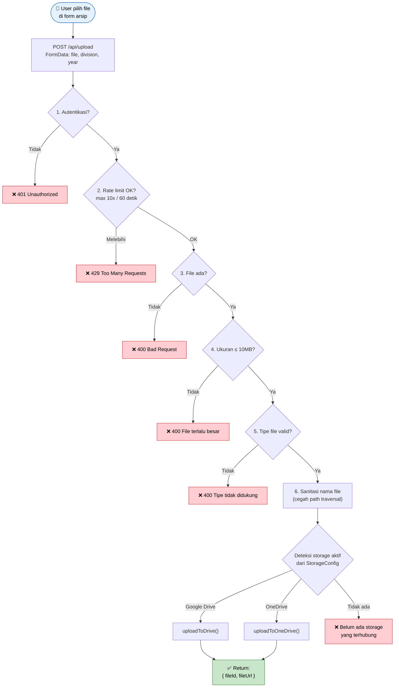

### Tipe File yang Didukung

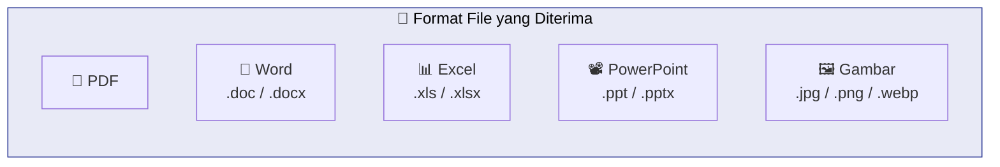

---

## 7. Flow Struktur Folder Cloud

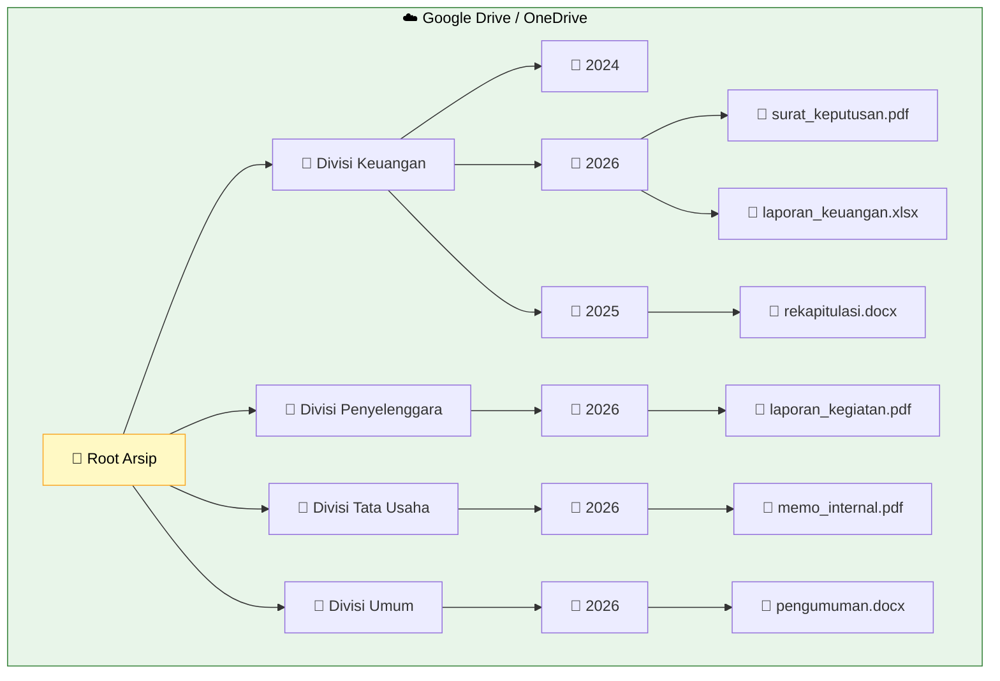

### Proses Pembuatan Folder Otomatis

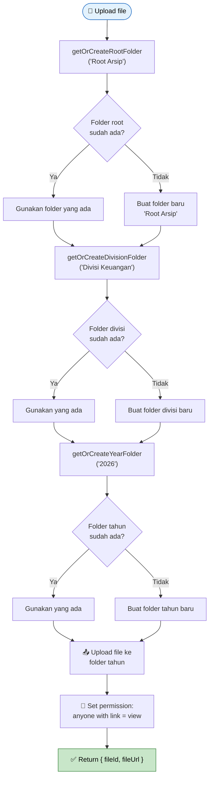

---

## 8. Flow Browse Arsip (Folder View)

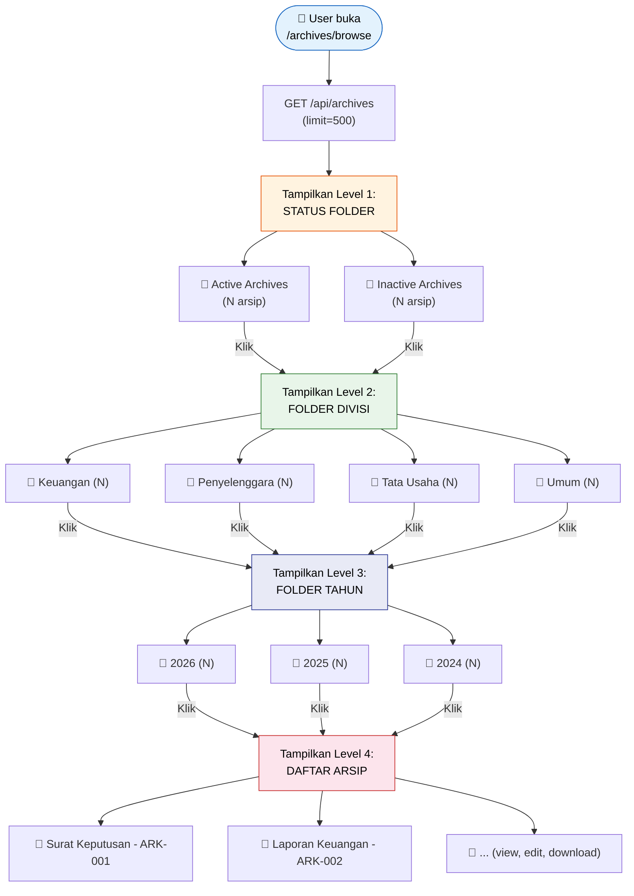

### Navigasi Breadcrumb

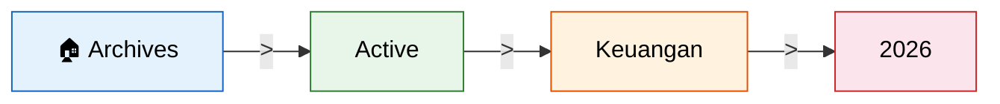

---

## 9. Flow Filter & Pencarian

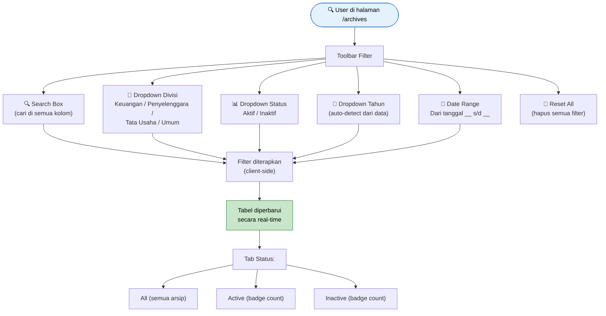

---

## 10. Flow Export Arsip

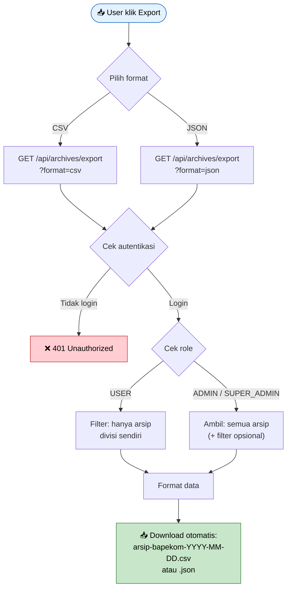

### Kolom CSV Export

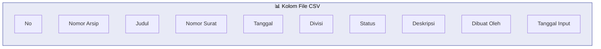

---

## 11. Flow Notifikasi

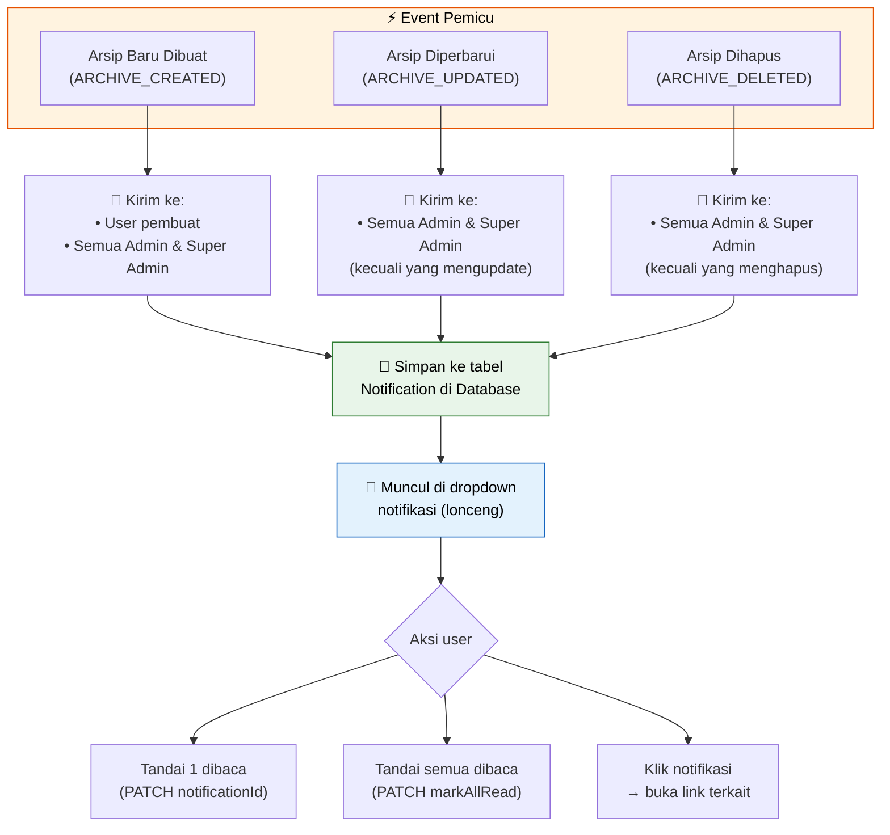

---

## 12. Flow Manajemen User

> Hanya **SUPER_ADMIN** yang bisa mengelola user.

```mermaid
flowchart TD
    A([🛡️ Super Admin buka<br/>/admin/users]) --> B{Role = SUPER_ADMIN?}
    B -->|Tidak| C["❌ Redirect ke Dashboard<br/>Tidak punya akses"]
    B -->|Ya| D["GET /api/users<br/>Tampilkan daftar user"]
    
    D --> E{Aksi yang dipilih}
    
    E -->|Tambah User| F["Isi form:<br/>Nama, Email, Password,<br/>Role, Divisi"]
    F --> G["POST /api/users"]
    G --> H{Validasi}
    H -->|Email sudah ada| I["❌ Error: Email duplikat"]
    H -->|OK| J["✅ User baru dibuat"]
    
    E -->|Edit User| K["Ubah field yang diinginkan"]
    K --> L["PUT /api/users/:id"]
    L --> M["✅ User diperbarui"]
    
    E -->|Hapus User| N{Validasi hapus}
    N -->|Hapus diri sendiri| O["❌ Tidak bisa<br/>hapus diri sendiri"]
    N -->|Masih punya arsip| P["❌ Tidak bisa hapus<br/>user yang punya arsip"]
    N -->|OK| Q["DELETE /api/users/:id"]
    Q --> R["✅ User dihapus"]

    style A fill:#e3f2fd,stroke:#1565c0,color:#000
    style C fill:#ffcdd2,stroke:#c62828,color:#000
    style I fill:#ffcdd2,stroke:#c62828,color:#000
    style J fill:#c8e6c9,stroke:#2e7d32,color:#000
    style M fill:#c8e6c9,stroke:#2e7d32,color:#000
    style O fill:#ffcdd2,stroke:#c62828,color:#000
    style P fill:#ffcdd2,stroke:#c62828,color:#000
    style R fill:#c8e6c9,stroke:#2e7d32,color:#000
```

---

## 13. Flow Profil Pengguna

```mermaid
flowchart TD
    A([👤 User buka /profile]) --> B["GET /api/profile"]
    B --> C["Tampilkan profil:<br/>Nama, Email, Role, Divisi,<br/>Foto, Jumlah Arsip, Tanggal Daftar"]
    
    C --> D{User ingin update?}
    D -->|Tidak| E[Selesai]
    D -->|Ya| F["Ubah field:<br/>Nama / Email / Divisi /<br/>Foto Profil / Password"]
    
    F --> G{Ganti password?}
    G -->|Ya| H["Wajib isi:<br/>Password lama + Password baru<br/>(min 6 karakter)"]
    G -->|Tidak| I[Lanjut]
    
    H & I --> J["PATCH /api/profile"]
    J --> K{Validasi}
    K -->|Password lama salah| L["❌ Error"]
    K -->|Email sudah dipakai| M["❌ Error: Email duplikat"]
    K -->|OK| N["✅ Profil diperbarui"]

    style A fill:#e3f2fd,stroke:#1565c0,color:#000
    style L fill:#ffcdd2,stroke:#c62828,color:#000
    style M fill:#ffcdd2,stroke:#c62828,color:#000
    style N fill:#c8e6c9,stroke:#2e7d32,color:#000
```

---

## 14. Flow Koneksi Storage

### 14.1 Koneksi Google Drive

```mermaid
flowchart TD
    A([🔗 Admin klik<br/>'Connect Google Drive']) --> B["GET /api/storage/connect-google"]
    B --> C["Server buat URL OAuth Google"]
    C --> D["↗️ Redirect ke<br/>accounts.google.com"]
    D --> E["👤 User login & izinkan<br/>akses ke Google Drive"]
    E --> F["Google redirect balik<br/>dengan AUTH_CODE"]
    F --> G["GET /api/storage/connect-google<br/>?code=AUTH_CODE"]
    G --> H["Exchange code → tokens<br/>(accessToken + refreshToken)"]
    H --> I["Nonaktifkan config<br/>Google Drive lama"]
    I --> J["💾 Simpan token baru<br/>isActive = true"]
    J --> K["↗️ Redirect ke<br/>/admin/storage?connected=google"]
    K --> L["✅ Google Drive terhubung!"]

    style A fill:#e3f2fd,stroke:#1565c0,color:#000
    style D fill:#fff9c4,stroke:#f9a825,color:#000
    style L fill:#c8e6c9,stroke:#2e7d32,color:#000
```

### 14.2 Koneksi OneDrive

```mermaid
flowchart TD
    A([🔗 Admin klik<br/>'Connect OneDrive']) --> B["GET /api/storage/connect-onedrive"]
    B --> C["Server buat URL OAuth Microsoft"]
    C --> D["↗️ Redirect ke<br/>login.microsoftonline.com"]
    D --> E["👤 User login & izinkan<br/>akses ke OneDrive"]
    E --> F["Microsoft return<br/>AUTH_CODE"]
    F --> G["POST /api/storage/connect-onedrive<br/>Body: { code: AUTH_CODE }"]
    G --> H["Exchange code → tokens"]
    H --> I["Nonaktifkan config<br/>OneDrive lama"]
    I --> J["💾 Simpan token baru<br/>isActive = true"]
    J --> K["✅ OneDrive terhubung!"]

    style A fill:#e3f2fd,stroke:#1565c0,color:#000
    style D fill:#fff9c4,stroke:#f9a825,color:#000
    style K fill:#c8e6c9,stroke:#2e7d32,color:#000
```

---

## 15. Flow RBAC (Hak Akses)

### Matriks Hak Akses per Role

```mermaid
graph TD
    subgraph ROLES["👥 Tiga Level Pengguna"]
        direction LR
        
        subgraph SA["🔴 SUPER ADMIN<br/>(Pimpinan)"]
            SA1["✅ Semua fitur"]
            SA2["✅ Kelola user"]
            SA3["✅ Kelola storage"]
            SA4["✅ Semua divisi"]
        end
        
        subgraph AD["🟡 ADMIN<br/>(Pengelola)"]
            AD1["✅ CRUD arsip semua divisi"]
            AD2["❌ Tidak bisa kelola user"]
            AD3["✅ Kelola storage"]
            AD4["✅ Terima notifikasi admin"]
        end
        
        subgraph US["🟢 USER<br/>(Staff)"]
            US1["✅ Buat arsip"]
            US2["❌ Tidak bisa edit/hapus"]
            US3["👁️ Hanya divisi sendiri"]
            US4["✅ Export divisi sendiri"]
        end
    end

    style SA fill:#ffcdd2,stroke:#c62828,color:#000
    style AD fill:#fff9c4,stroke:#f9a825,color:#000
    style US fill:#c8e6c9,stroke:#2e7d32,color:#000
```

### Detail Akses per Fitur

```mermaid
flowchart LR
    subgraph FITUR["Fitur"]
        F1["Buat Arsip"]
        F2["Lihat Semua Divisi"]
        F3["Lihat Divisi Sendiri"]
        F4["Edit Arsip"]
        F5["Hapus Arsip"]
        F6["Export"]
        F7["Kelola User"]
        F8["Kelola Storage"]
        F9["Dashboard"]
        F10["Edit Profil"]
    end
    
    subgraph ACCESS["Akses"]
        A1["Semua Role ✅"]
        A2["ADMIN + SUPER_ADMIN"]
        A3["Semua Role ✅"]
        A4["ADMIN + SUPER_ADMIN"]
        A5["ADMIN + SUPER_ADMIN"]
        A6["Semua (USER=divisi sendiri)"]
        A7["SUPER_ADMIN saja"]
        A8["ADMIN + SUPER_ADMIN"]
        A9["Semua Role ✅"]
        A10["Semua Role ✅"]
    end
    
    F1 --- A1
    F2 --- A2
    F3 --- A3
    F4 --- A4
    F5 --- A5
    F6 --- A6
    F7 --- A7
    F8 --- A8
    F9 --- A9
    F10 --- A10
```

---

## 16. Flow Rate Limiting

```mermaid
flowchart TD
    A([📨 Request masuk]) --> B["checkRateLimit<br/>(identifier, maxRequests,<br/>windowSeconds)"]
    B --> C{Entry ada<br/>di memory?}
    
    C -->|Tidak / Baru| D["Buat entry baru<br/>count = 1"]
    C -->|Sudah ada| E{Window waktu<br/>sudah expired?}
    
    E -->|Ya, expired| F["Reset count = 1<br/>Window baru dimulai"]
    E -->|Belum expired| G["count = count + 1"]
    
    G --> H{count > maxRequests?}
    H -->|Tidak| I["✅ Request diizinkan<br/>remaining = max - count"]
    H -->|Ya, melebihi| J["❌ 429 Too Many Requests<br/>remaining = 0"]
    
    D --> I
    F --> I

    style A fill:#e3f2fd,stroke:#1565c0,color:#000
    style I fill:#c8e6c9,stroke:#2e7d32,color:#000
    style J fill:#ffcdd2,stroke:#c62828,color:#000
```

### Endpoint yang Dilindungi Rate Limit

```mermaid
graph LR
    subgraph RL["🛡️ Rate Limit"]
        direction TB
        subgraph LOGIN["Login"]
            L1["Identifier: login:email"]
            L2["Limit: 5 request"]
            L3["Window: 60 detik"]
        end
        subgraph UPLOAD["Upload File"]
            U1["Identifier: upload:userId"]
            U2["Limit: 10 request"]
            U3["Window: 60 detik"]
        end
    end

    style LOGIN fill:#fff3e0,stroke:#e65100,color:#000
    style UPLOAD fill:#e8eaf6,stroke:#283593,color:#000
```

---

## 17. Ringkasan Seluruh API

```mermaid
graph TD
    subgraph API["🌐 API Endpoints"]
        direction TB
        
        subgraph AUTH_API["🔐 Autentikasi"]
            E1["POST /api/auth/[...nextauth]<br/>Login & Session"]
        end
        
        subgraph ARCHIVE_API["📁 Arsip"]
            E2["GET /api/archives → Daftar arsip"]
            E3["POST /api/archives → Buat arsip baru"]
            E4["GET /api/archives/:id → Detail arsip"]
            E5["PUT /api/archives/:id → Update arsip"]
            E6["DELETE /api/archives/:id → Hapus arsip"]
            E7["GET /api/archives/export → Export CSV/JSON"]
        end
        
        subgraph UPLOAD_API["📤 Upload"]
            E8["POST /api/upload → Upload file ke cloud"]
        end
        
        subgraph USER_API["👥 User (Super Admin)"]
            E9["GET /api/users → Daftar user"]
            E10["POST /api/users → Buat user"]
            E11["PUT /api/users/:id → Update user"]
            E12["DELETE /api/users/:id → Hapus user"]
        end
        
        subgraph PROFILE_API["👤 Profil"]
            E13["GET /api/profile → Lihat profil"]
            E14["PATCH /api/profile → Update profil"]
        end
        
        subgraph NOTIF_API["🔔 Notifikasi"]
            E15["GET /api/notifications → Daftar notifikasi"]
            E16["PATCH /api/notifications → Tandai dibaca"]
        end
        
        subgraph STORAGE_API["☁️ Storage"]
            E17["GET /api/storage/info → Info storage"]
            E18["GET /api/storage/connect-google → OAuth Google"]
            E19["GET+POST /api/storage/connect-onedrive → OAuth OneDrive"]
        end
    end

    style AUTH_API fill:#ffcdd2,stroke:#c62828,color:#000
    style ARCHIVE_API fill:#c8e6c9,stroke:#2e7d32,color:#000
    style UPLOAD_API fill:#fff9c4,stroke:#f9a825,color:#000
    style USER_API fill:#e8eaf6,stroke:#283593,color:#000
    style PROFILE_API fill:#e3f2fd,stroke:#1565c0,color:#000
    style NOTIF_API fill:#fff3e0,stroke:#e65100,color:#000
    style STORAGE_API fill:#f3e5f5,stroke:#6a1b9a,color:#000
```

---

## 🔄 Flow Keseluruhan Sistem (End-to-End)

```mermaid
flowchart TD
    START([🧑 Pengguna]) --> LOGIN["1. Login<br/>(Email + Password)"]
    LOGIN --> MW["2. Middleware<br/>Cek akses"]
    MW --> DASH["3. Dashboard<br/>Lihat statistik"]
    
    DASH --> MENU{Menu utama}
    
    MENU --> ARS["📁 Kelola Arsip"]
    MENU --> BRW["📂 Browse Folder"]
    MENU --> EXP["📥 Export Data"]
    MENU --> PRF["👤 Profil"]
    MENU --> ADM["🛡️ Admin Panel"]
    
    ARS --> ARS_CREATE["Buat Arsip Baru<br/>+ Upload File"]
    ARS --> ARS_LIST["Lihat & Filter<br/>Daftar Arsip"]
    ARS --> ARS_EDIT["Edit Arsip<br/>(Admin+)"]
    ARS --> ARS_DEL["Hapus Arsip<br/>(Admin+)"]
    
    ARS_CREATE --> UPLOAD["☁️ Upload ke<br/>Google Drive / OneDrive"]
    ARS_CREATE --> NOTIF["🔔 Notifikasi<br/>ke Admin"]
    
    BRW --> FOLDER["Navigasi:<br/>Status → Divisi → Tahun → File"]
    
    EXP --> EXPORT["Download CSV / JSON"]
    
    PRF --> PROFILE["Edit nama, email,<br/>foto, password"]
    
    ADM --> USR["Kelola User<br/>(Super Admin)"]
    ADM --> STR["Koneksi Storage<br/>(Admin+)"]

    style START fill:#e3f2fd,stroke:#1565c0,color:#000
    style LOGIN fill:#fff9c4,stroke:#f9a825,color:#000
    style DASH fill:#c8e6c9,stroke:#2e7d32,color:#000
    style UPLOAD fill:#f3e5f5,stroke:#6a1b9a,color:#000
    style NOTIF fill:#fff3e0,stroke:#e65100,color:#000
```

---

> **Catatan:** Diagram di atas menggunakan format [Mermaid](https://mermaid.js.org/) yang dapat di-render otomatis di GitHub, GitLab, dan berbagai markdown viewer modern.
